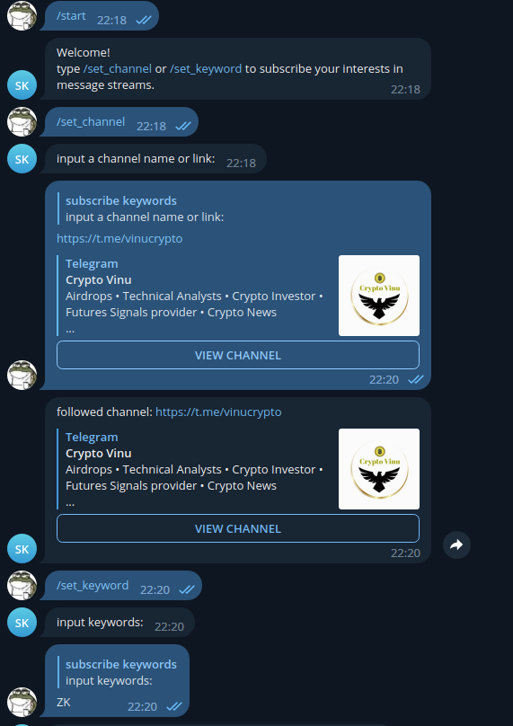

# subscribe keywords bot
link: https://t.me/subscribe_keywords_bot
Just set the channels you want to follow and the keywords you focus in the bot. The bot will transmit the message from the channels if it contains the keywords you interest.

